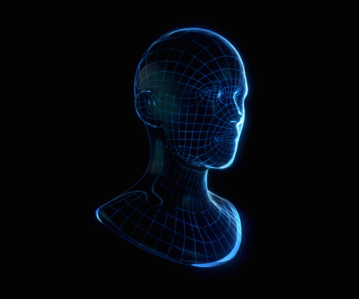
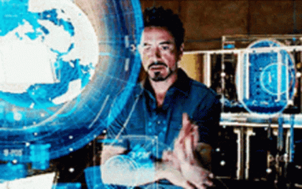

  

 

  <table border="0" style="border-collapse: separate; border-spacing: 0; background-color: #050505; border-left: 4px solid #00F0FF; border-right: 4px solid #FF003C; color: #A9B2C3;" width="85%">
    <tr>
      <td align="center" width="30%" style="padding: 15px; border-top: 1px solid #00F0FF; border-bottom: 1px solid #00F0FF;">
        
      </td>
      <td width="70%" style="padding: 20px; border-top: 1px solid #FF003C; border-bottom: 1px solid #FF003C; text-align: left;">
        <h2 style="color: #FF003C; margin-top: 0;">[ DOSSIER: AGRA ]</h2>
        <ul style="list-style-type: none; padding-left: 0; line-height: 1.8;">
          <strong style="color: #00F0FF;">ROLE:</strong> Frontend Architect & Interface Engineer 
          <strong style="color: #00F0FF;">CORE_SYSTEMS:</strong> React.js, Next.js, Tailwind CSS 
          <strong style="color: #00F0FF;">VISUAL_PROTOCOL:</strong> Minimalist Agency Emblems & Geometric Vectors
        </ul>
        

        <h3 style="color: #00F0FF; margin-top: 0;">[ ARSENAL ]</h3>
        

          
          
          
          
        

      </td>
    </tr>
  </table>

 

  <table border="0" style="border-collapse: separate; border-spacing: 0; background-color: #050505; border: 1px solid #00F0FF; border-radius: 4px; color: #A9B2C3;" width="85%">
    <tr>
      <td style="padding: 20px; text-align: left;">
        <h3 style="color: #00F0FF; margin-top: 0; margin-bottom: 15px;">[ CLASSIFIED OPERATIONS ]</h3>
        <ul style="list-style-type: square; color: #FF003C; line-height: 1.8; margin-bottom: 0;">
          <li><strong style="color: #00F0FF;">Global Intelligence Network:</strong> Antarmuka portal web utama yang dibangun menggunakan React, Next.js, dan Tailwind CSS.</li>
          <li><strong style="color: #00F0FF;">Project Night Owl:</strong> Desain emblem agensi berbasis burung hantu minimalis dengan pembatasan geometris presisi tinggi.</li>
        </ul>
      </td>
    </tr>
  </table>

 

  <table border="0" width="85%" style="background-color: transparent;">
    <tr>
      <td width="70%" align="center">
        
      </td>
      <td width="30%" align="center" style="padding-left: 15px;">
        
      </td>
    </tr>
  </table>

